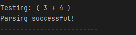
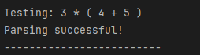
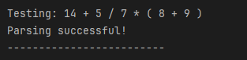
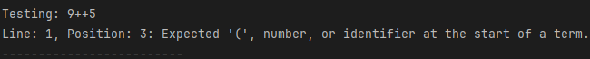
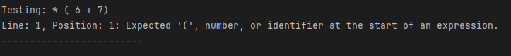

# Entregable 3.3
## Armando Arredondo Valle | A01424709

### Casos de prueba
### Casos de prueba

#### Caso 1
**Entrada:** `( 3 + 4 )`  
**Resultado esperado:** Parsing successful!  

#### Caso 2
**Entrada:** `3 * ( 4 + 5 )`  
**Resultado esperado:** Parsing successful!  

#### Caso 3
**Entrada:** `14 + 5 / 7 * ( 8 + 9 )`  
**Resultado esperado:** Parsing successful!  

#### Caso 4
**Entrada:** `9++5`  
**Resultado esperado:**  
Line: 1, Position: 3: Expected '(', number, or identifier at the start of a term.  

#### Caso 5
**Entrada:** `* ( 6 + 7 )`  
**Resultado esperado:**  
Line: 1, Position: 1: Expected '(', number, or identifier at the start of an expression.
